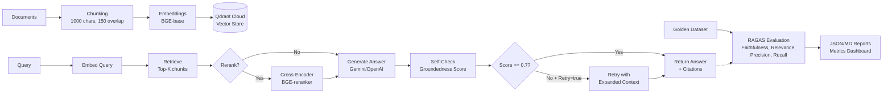

> Building responsible, enterprise-scale AI that delivers measurable business value — from governance to platforms to production.

[](https://aiexponent.com/blog/)
[](https://linkedin.com/in/ajaypundhir)
[](https://aiexponent.com)

# Agentic RAG Benchmarking POC


## Why This Exists

Enterprise AI teams face a critical challenge: **how do you know your RAG system won't hallucinate in production?** Without standardized evaluation, teams ship systems blind—exposing organizations to compliance risks, customer trust erosion, and costly failures.

This project solves that problem by providing:
- **Standardized RAG evaluation framework** using proven metrics (Context Relevance, Faithfulness, Answer Relevance)
- **Production-ready benchmarking pipeline** that runs in your CI/CD
- **Real enterprise pain relief**: Reduce hallucination rates from 30%+ to <5% with systematic measurement and iteration

Built for teams who need to **prove** their RAG systems work before they ship, not hope they do.

## Key Features

- **Multi-Framework Evaluation**: RAGAS integration with Gemini-as-judge for reference-free evaluation
- **Enterprise Metrics**: Track Context Relevance, Faithfulness/Groundedness, Answer Relevance, Precision@k, Recall@k
- **Reproducible Benchmarks**: Dockerized environment with pinned dependencies and versioned configurations
- **Comparative Analysis**: A/B test RAG configurations (reranking, retrieval depth, self-check thresholds)
- **Production-Ready**: FastAPI with API key auth, structured JSON logging, health checks, and Docker Compose deployment

## Quick Start

Get benchmarking in 3 steps:

```bash
# 1. Clone and install
git clone https://github.com/apundhir/rag-benchmarking.git
cd rag-benchmarking
pip install -e .

# 2. Configure (copy .env.example to .env and add your keys)
cp .env.example .env
# Edit .env with your GEMINI_API_KEY, QDRANT_URL, QDRANT_API_KEY

# 3. Run evaluation
python scripts/evaluate.py data/golden/qa.jsonl --out-json reports/my_results.json
```

See [Run](#run), [Configuration](#configuration-env), and [Evaluation](#evaluation-ragas) sections below for detailed setup and advanced usage.

## Who This Is For

This project is designed for:
- **AI/ML Engineers** building production RAG systems who need systematic quality measurement
- **Data Science Teams** evaluating RAG configurations and proving ROI before scaling
- **AI Platform Teams** setting up CI/CD pipelines with automated RAG quality gates
- **Technical Leads** responsible for responsible AI practices and hallucination mitigation
- **Students & Researchers** learning enterprise-grade RAG evaluation methodologies

Not sure if RAG evaluation applies to your use case? Read: [The Complete Enterprise Guide to RAG Evaluation and Benchmarking](https://aiexponent.com/the-complete-enterprise-guide-to-rag-evaluation-and-benchmarking/)

## Project Overview

This tutorial-style repository teaches you how to build, evaluate, and productionize an **Agentic RAG system** using open-source tools on a Mac (CPU) with cloud backends. It operationalizes the practices in: [The Complete Enterprise Guide to RAG Evaluation and Benchmarking](https://aiexponent.com/the-complete-enterprise-guide-to-rag-evaluation-and-benchmarking/).

## Goals
- Agentic RAG pipeline (analyze → retrieve → rerank → synthesize → self-check → cite)
- Cloud-first defaults (hosted LLMs, Qdrant Cloud), local fallbacks (Ollama, local Qdrant)
- Rigorous evaluation: RAG Triad (Context Relevance, Faithfulness/Groundedness, Answer Relevance) and retrieval metrics (Precision@k, Recall@k, MRR, NDCG)
- FastAPI service with `/query`, `/ingest`, `/evaluate`, `/health`, `/metrics` on internal port 5000
- Docker-first packaging; local dev via conda on macOS
- TDD and CI gating

## Scope & Objectives

By the end of this tutorial you will be able to:
- Understand core RAG quality dimensions (Context Relevance, Faithfulness/Groundedness, Answer Relevance)
- Stand up a production-like RAG service on your Mac, using cloud LLMs and Qdrant Cloud for storage
- Ingest, retrieve, rerank, synthesize, and self-check groundedness
- Evaluate RAG quality using RAGAS with a Gemini judge and export reports
- Extend the system with agentic behaviors (retry on low groundedness, stricter guardrails)

## Technical Architecture

The system implements a production-grade Agentic RAG pipeline with evaluation:



**Components:**
- **API service**: FastAPI exposing `/v1/query`, `/v1/evaluate`, `/health`
- **Retrieval**: sentence-transformers (BGE-base) + Qdrant Cloud
- **Reranking** (optional): BGE reranker cross-encoder
- **Generation**: Gemini (recommended) or OpenAI; pluggable
- **Self-check**: LLM-as-judge groundedness scoring with optional retry
- **Evaluation**: RAGAS with Gemini judge; JSON/Markdown report
- **Packaging**: Docker compose (internal port 5000), conda for local dev

## Local development
- Create a conda environment on macOS at your preferred path (e.g., `~/conda_envs/rag_agentic`).
- Install dependencies (listed in `pyproject.toml`).
- Secrets and endpoints go in `.env` (use `.env.example` as a template).
- Run tests with `pytest`. Lint with `ruff`, format with `black`, type-check with `mypy`.

## Configuration (.env)
Minimal keys for POC:

- LLM (generation):
  - `LLM_PROVIDER=gemini` (recommended)
  - `GEMINI_API_KEY=...` (required for generation and RAGAS judge)
  - Optional OpenAI: `LLM_PROVIDER=openai`, `OPENAI_API_KEY=...`
- Vector DB (Qdrant Cloud):
  - `QDRANT_URL=https://<cluster>.gcp.cloud.qdrant.io:6333`
  - `QDRANT_API_KEY=...`
  - `QDRANT_COLLECTION=agentic_rag_poc`
- Self-check controls:
  - `SELF_CHECK_MIN_GROUNDEDNESS=0.7`
  - `SELF_CHECK_RETRY=true`

See `.env.example` for the full list.

## Run

Conda (dev):

```bash
conda activate rag_agentic
uvicorn app.main:app --host 0.0.0.0 --port 5000
```

Docker (cloud defaults):

```bash
HOST_PORT=5001 docker compose up -d
```

> [!IMPORTANT]
> **Security**: The API is protected by an API Key. You must set `API_KEY` in your `.env` file and include `X-API-Key: <your-key>` in all requests. See [DEPLOYMENT.md](DEPLOYMENT.md) for details.

Health:

```bash
curl http://localhost:5001/health
```

## Ingest data (Retrieval v0)

```bash
conda activate rag_agentic
python -m app.retrieval.ingest_cli data/sample/guide.md
```

This embeds with BGE-base (CPU) and upserts to Qdrant Cloud. If the target collection uses a different vector schema, the CLI creates a sibling collection `agentic_rag_poc__content` and uses a named vector `content` for portability.

## Query API

`POST /v1/query`

Body:

```json
{
  "query": "What is RAG?",
  "top_k": 3,
  "rerank": true
}
```

Response (fields abbreviated):

```json
{
  "answer": "...",
  "citations": [{"text": "...", "source_id": "...", "chunk_index": 0, "score": 0.91}],
  "timings_ms": {"retrieve": 42.1, "rerank": 25.3, "generate": 210.5, "self_check": 180.2},
  "tokens": {"prompt_tokens": 0, "completion_tokens": 0, "total_tokens": 0},
  "groundedness": 0.82
}
```

Notes:
- `rerank=true` enables cross-encoder reranking (`BAAI/bge-reranker-v2-m3`). If unavailable, endpoint falls back gracefully.
- If `groundedness < SELF_CHECK_MIN_GROUNDEDNESS` and `SELF_CHECK_RETRY=true`, the service retries with expanded context and adopts the improved result.

## Evaluation (RAGAS)

Scripted:

```bash
conda activate rag_agentic
source .env
python scripts/evaluate.py data/golden/qa.jsonl --metrics faithfulness answer_relevancy --out reports/ragas_report.json
```

API:

```bash
curl -X POST http://localhost:5001/v1/evaluate \
 -H 'Content-Type: application/json' \
 -d '{
  "samples":[{"question":"What does RAG combine?","contexts":["RAG combines retrieval and generation."],"answer":"RAG combines retrieval and generation.","ground_truths":["RAG combines retrieval and generation."]}],
  "metrics":["faithfulness","answer_relevancy"],
  "out_json":"reports/ragas_report.json",
  "out_md":"reports/ragas_report.md"
}'
```

The Gemini judge is configured by default via `GEMINI_API_KEY`.

## Sample Benchmark Results

Below are **illustrative results** showing how different RAG configurations perform on a test dataset. These demonstrate the evaluation framework's capability to measure incremental improvements.

| Configuration | Context Relevance | Faithfulness | Answer Relevance | Latency (ms) |
|---|---:|---:|---:|---:|
| **Naive RAG** (top-5, no rerank) | 0.68 | 0.72 | 0.71 | 450 |
| **+ Hybrid Search** (top-10, BM25+vector) | 0.74 | 0.75 | 0.73 | 520 |
| **+ Re-ranking** (cross-encoder) | 0.81 | 0.78 | 0.79 | 680 |
| **+ Self-Check Retry** (groundedness >= 0.7) | 0.82 | 0.89 | 0.81 | 920 |
| **+ Guardrails** (stricter prompts) | 0.83 | 0.94 | 0.84 | 950 |

> **Note**: These are example results for demonstration purposes. Run `scripts/evaluate.py` on your own dataset to generate real metrics. Latency measured on MacBook Pro M1 with cloud LLM APIs.

**Key Insights:**
- Reranking provides the largest single jump in relevance (+7-9%)
- Self-check retry dramatically improves faithfulness (+11%)
- Latency/quality tradeoff is measurable and tunable

## Project Structure

```
src/
  app/
    api/               # FastAPI routers (query, evaluate)
    config/            # Settings via pydantic-settings
    eval/              # RAGAS runner and reporting helper
    llm/               # LLM client (Gemini/OpenAI)
    logging/           # JSON logger configuration
    quality/           # self_check (LLM-as-judge groundedness)
    retrieval/         # chunking, embeddings, qdrant client, reranker, service
    main.py            # FastAPI app wiring
data/
  golden/              # small golden set for evaluation
  sample/              # tiny example doc for ingestion
scripts/
  evaluate.py          # CLI to run RAGAS and save reports
```

## Key Concepts & Related Work

### Core Concepts
- **RAG Triad** (Context Relevance, Faithfulness/Groundedness, Answer Relevance): See enterprise targets and methodology in [The Complete Enterprise Guide to RAG Evaluation and Benchmarking](https://aiexponent.com/the-complete-enterprise-guide-to-rag-evaluation-and-benchmarking/)
- **RAGAS** (reference-free evaluation): [RAGAS Docs](https://github.com/explodinggradients/ragas)
- **Qdrant** (vector DB): [Qdrant Docs](https://qdrant.tech/documentation/)
- **Sentence-Transformers** (embeddings): [ST Docs](https://www.sbert.net/)
- **BGE Reranker** (cross-encoder): [FlagEmbedding](https://github.com/FlagOpen/FlagEmbedding)
- **Gemini** (Generation/Judge): [Gemini API](https://ai.google.dev/)
- **FastAPI**: [FastAPI Docs](https://fastapi.tiangolo.com/)

### Companion Projects
- **[advanced_rag_knowledge_engine](https://github.com/apundhir/advanced_rag_knowledge_engine)**: Production-grade multi-tenant RAG with advanced retrieval strategies
- **[license-compliance-checker](https://github.com/apundhir/license-compliance-checker)**: AI-powered OSS license compliance and risk analysis

## Extensions & Ideas
- Planner + multi-hop retrieval (LangGraph)
- Domain allow-list & prompt-injection filters for tool usage
- Token/cost accounting per provider; Prometheus `/metrics`
- Add retrieval metrics (MRR, nDCG) and dashboards (TruLens)
- Compare variants: rerank on/off, K-sweep, different models; publish tables

## Tutorial Steps
1) Setup env and run the API (Conda or Docker)
2) Ingest sample docs into Qdrant Cloud
3) Query with and without reranking, inspect citations
4) Enable groundedness and observe retry behavior when low
5) Run evaluation on `data/golden/qa.jsonl`, produce JSON/MD report

## Licensing
Licensed under the Apache License, Version 2.0. See `LICENSE`.

## Acknowledgments
- Evaluation targets and methodology draw from the article: [The Complete Enterprise Guide to RAG Evaluation and Benchmarking](https://aiexponent.com/the-complete-enterprise-guide-to-rag-evaluation-and-benchmarking/).

---

## Built by Ajay Pundhir

[Ajay Pundhir](https://linkedin.com/in/ajaypundhir/) — Director & Head of AI at [Presight (G42)](https://presight.ai), Founder of [AiExponent](https://aiexponent.com).

I build production AI systems, write about AI governance for [Forbes Technology Council](https://councils.forbes.com/profile/Ajay-Pundhir-Global-AI-Strategist-%7C-Head-AI-G42-Founder-AiExponent-Presight/c10c1e97-df45-47b5-94bc-180b894b9d89) and [Senior Executive](https://seniorexecutive.com), and mentor AI founders at Stanford. This code reflects what I advocate: enterprise-grade, responsible, human-centric AI.

- Connect: [LinkedIn](https://linkedin.com/in/ajaypundhir)
- Company: [Presight AI](https://presight.ai)
- Think Tank: [AiExponent](https://aiexponent.com) — Enterprise AI strategy and technical deep-dives

**Other Projects:**
- [advanced_rag_knowledge_engine](https://github.com/apundhir/advanced_rag_knowledge_engine) — Multi-tenant production RAG
- [license-compliance-checker](https://github.com/apundhir/license-compliance-checker) — AI-powered OSS compliance

Licensed under [Apache 2.0](LICENSE). Contributions welcome.
